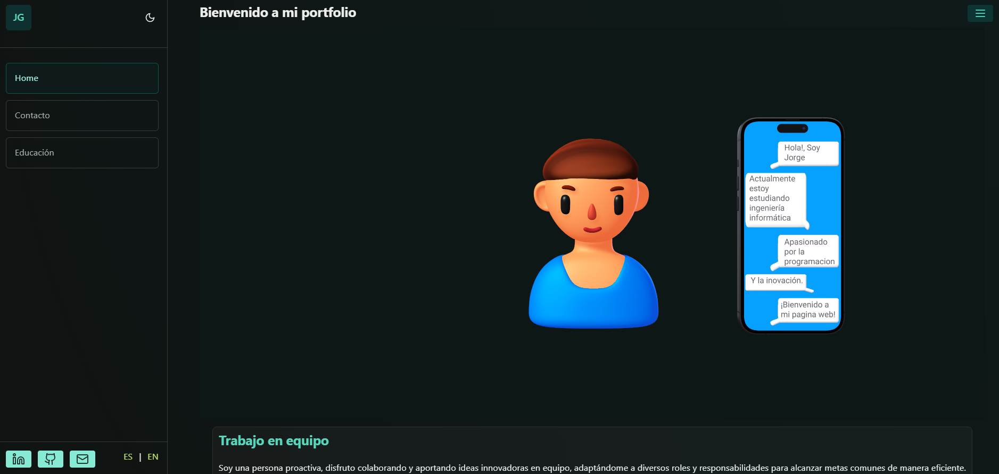
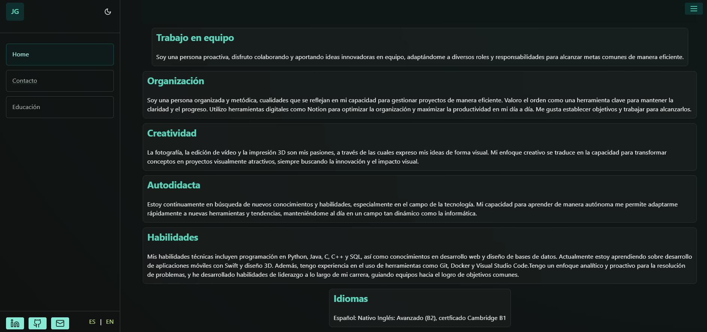
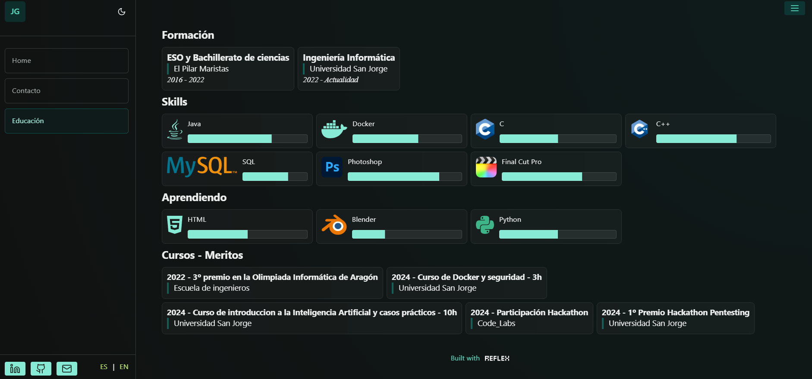

# Portfolio

Este es un ejemplo de mi portfolio que desarrollé en mi tiempo libre para aprender a utilizar un framework de creación de sitios web con Python. Aqui hay algunas imagenes de como se ve el sitio web:



## Reflex

Reflex es un framework para construir aplicaciones web interactivas de manera sencilla y eficiente. Para ejecutar este proyecto, sigue los siguientes pasos:

### Instalación

Primero, asegúrate de tener instaladas todas las dependencias necesarias. Puedes hacerlo ejecutando:

```sh
git clone https://github.com/jrgim/Jorge_Portfolio.git
pip install -r requirements.txt
reflex run
```